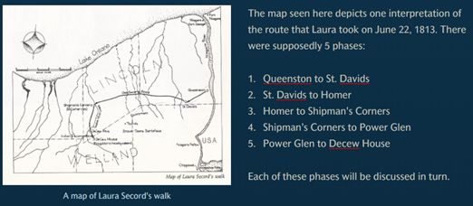

![storymaps_logo][./assets/storymaplogo.jpg]

# Introduction to ArcGIS StoryMaps
ArcGIS StoryMaps provides a platform for sharing maps, images, videos and narrative content with your peers and the world. This tutorial provides a step-by-step instruction document introducing ArcGIS StoryMaps. The subject matter for this storymap includes multi-media pieces describing the treacherous journey Laura Secord took to save her country. Let’s get started!

### Section One
1.	Go to https://storymaps.arcgis.com/ and sign in using your Brock University credentials. The home page will list any storymaps you’ve already created. If you’re new to the platform, get started by clicking +New Story > Start from scratch.
2.	Add a title (Walking Laura’s Way) and subtitle (a story about Laura Secord’s famous journey)
3.	At the top right of the workspace, click Add Cover Image or video     
4.	Navigate to the LauraSecordImages folder and select an image (TwelveMileCreek.jpg)  
5.	Click Design at the top centre of the window. Explore the design options available. For example, change the cover settings, turn on Navigation (explained later) and select a Theme (Tidal).  

NOTE: ArcGIS StoryMaps offers autosave every few seconds so there is no need to worry about losing your work.  

### Section Two
1.	Scroll down and begin telling the story of Laura Secord’s journey.  
 
StoryMaps are broken down by ‘content blocks’. Click the plus sign to see the options available.  

2.	Add text “Introduction” and format it as a heading. HINT: highlight the text to access formatting options.  
3.	All headers are included in the navigation bar at the top of the story.  
4.	Copy and paste the introduction provided below:    

Introduction:  
On the 22nd of June, 1813, Laura was busy tending to the militia bunking at her homestead in the small town of Queenston. Being a woman, she was not suspected of espionage and so she learned of a sneak attack the Americans were planning later that week in Thorold. With her husband unwell, Laura resolutely decided to make the treacherous journey on her own to warn Lt. Fitzgibbon and save Upper Canada.  

### Section Three  
1. Scroll down, click the plus sign and add an image (LauraSecordsWalk2.jpg).  
2. Change the settings to float. 
3. Add a caption "A map of Laura Secord's walk".  
4. Click the gears button to access options including alternative text for screen readers.  
5. To the right of the map, +Continue your story by adding the text: 

The map seen here depicts one interpretation of the route that Laura took on June 22, 1813. There were supposedly 5 phases: Queenston to St. Davids, St. Davids to Homer, Homer to Shipman’s Corners, Shipman’s Corners to Power Glen, Power Glen to Decew House
 
 
   

  ---
  ### Section Four  
 1.	Click the plus icon and select the embed option. This feature allows you to paste a link to content such as this video https://youtu.be/_L-vL5NFkYA OR <iframe> code from another website. For example, you can embed content from an OMEKA site.  
  ---
  
**This tutorial is brought to you by the Brock University Digital Scholarship Lab.  For more information on the DSL check out our website at [www.brocku.ca/library/dsl/](https://brocku.ca/library/dsl/) or you can e-mail us at dsl@brocku.ca.**  
  
You can also find us on:  
[Facebook](https://www.facebook.com/Brock-University-Digital-Scholarship-Lab-349407235866792/)  
[Twitter](https://twitter.com/brock_dsl)  
[Instagram](https://www.instagram.com/brock_dsl/?hl=en)  
[YouTube](https://www.youtube.com/channel/UC2eEqPkDo-1N3qilxv-N_1g/featured?view_as=subscriber)

<!--- Please use reference style images so that it is easier to update pictures later --->

[imglogo]: INSERT LOGO FILENAME HERE
