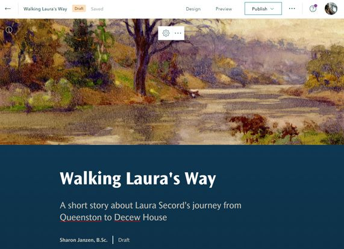
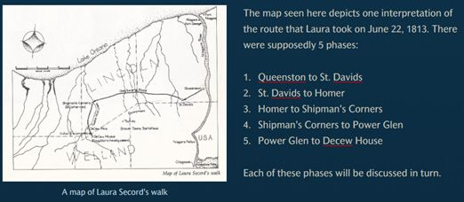
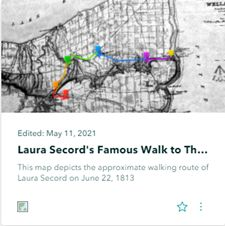
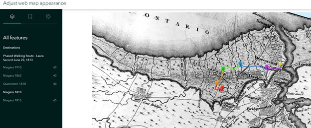
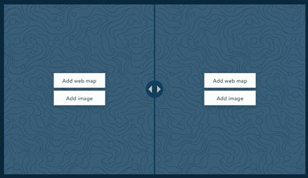
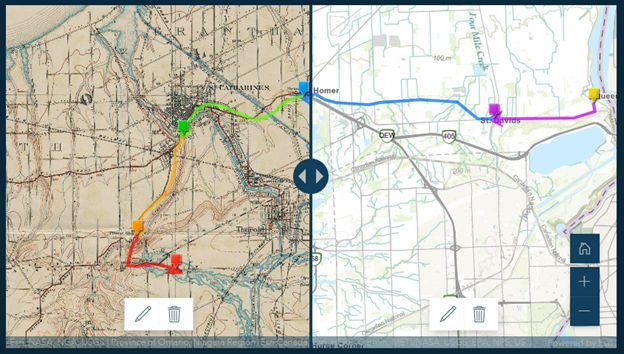
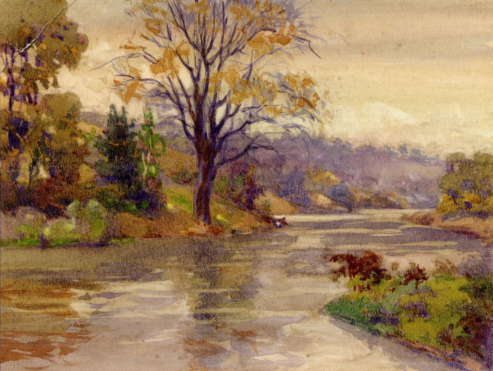

# Introduction to ArcGIS StoryMaps
ArcGIS StoryMaps provides a platform for sharing maps, images, videos and narrative content with your peers and the world. This tutorial provides a step-by-step instruction document introducing ArcGIS StoryMaps. The subject matter for this storymap includes multi-media pieces describing the treacherous journey Laura Secord took to save her country. For inspiration, watch this heritage minute video [https://youtu.be/_L-vL5NFkYA](https://youtu.be/_L-vL5NFkYA)  

Let’s get started! 

### Section One
1.	[Download and unzip the images file](https://github.com/BrockDSL/StoryMapDemo2/blob/master/LauraSecordImages.zip). 
2.	Go to [https://storymaps.arcgis.com/](https://storymaps.arcgis.com/) and sign in using your Brock University credentials. The home page will list any storymaps you’ve already created. If you’re new to the platform, get started by clicking +New Story > Start from scratch.
3.	Add a title (Walking Laura’s Way) and subtitle (a story about Laura Secord’s famous journey)
4.	At the top right of the workspace, click Add Cover Image or video     
5.	Navigate to the LauraSecordImages folder and select an image (TwelveMileCreekPainting.jpg) Courtesy of Toronto Public Library.  
6.	Click Design at the top centre of the window. Explore the design options available. For example, change the cover settings, turn on Navigation (explained later) and select a Theme (Tidal).  

 
 NOTE: ArcGIS StoryMaps performs *autosave* every few seconds.  
 
---

### Section Two
1.	Scroll down and begin telling the story of Laura Secord’s journey. 
2.	StoryMaps are broken down by ‘content blocks’. Click the plus sign to see the options available.  
3.	Add text “Introduction” and format it as a heading. HINT: highlight the text to access formatting options.  
4.	All headers are included in the navigation bar at the top of the story.  
5.	Copy and paste the introduction provided below:    

>Introduction: On the 22nd of June, 1813, Laura was busy tending to the militia bunking at her homestead in the small town of Queenston. Being a woman, she was not suspected of espionage and so she learned of a sneak attack the Americans were planning later that week in Thorold. With her husband unwell, Laura resolutely decided to make the treacherous journey on her own to warn Lt. Fitzgibbon and save Upper Canada.  

---

### Section Three  
1. Scroll down, click the plus sign and add an image (MapLauraSecordsWalk.jpg).  
2. Change the settings to float. 
3. Add a caption "A map of Laura Secord's walk".  
4. Click the gears button to access options including alternative text for screen readers.  
5. To the right of the map, +Continue your story by adding the text: 

>The map seen here depicts one interpretation of the route that Laura took on June 22, 1813. There were supposedly 5 phases: Queenston to St. Davids, St. Davids to Homer, Homer to Shipman’s Corners, Shipman’s Corners to Power Glen, Power Glen to Decew House
 
 
   

  ---
### Section Four  

 1.	Click the plus icon and select the embed option. This feature allows you to paste a link to content such as this video [https://youtu.be/_L-vL5NFkYA](https://youtu.be/_L-vL5NFkYA) OR <iframe> code from another website ( <iframe width="1080" height="720" frameborder="0" scrolling="no" allowfullscreen src="https://arcg.is/1fG8fP0"></iframe> ) or simply a URL ( https://arcg.is/1fG8fP0 ). Try various options and see the result.   

  ---
  
### Section Five  

1.	Add text and format as a heading (“The 5 Phases of Laura’s Walk”)  
2.	Click the plus icon and select Sidecar under the immersive section. A sidecar allows you to have a ‘main stage’ of content with a scrolling ‘sidecar’ of additional information.  
3.	Select the ‘docked’ option. Click Done.   
4.	For the main stage on the right, Add media > Add map  
5. Select the map created in the **[Introduction to ArcGIS Online tutorial](https://brockdsl.github.io/Introduction-to-ArcGIS-Online/Tutorial)**	
6. Alternately, select My Organization tab and search for “Laura Secord’s Famous Walk to Thorold”. 
7. Click the star to add the map to your favourites.  
8.	Click the search result and click Place Map.   

   

---

### Section Six  

1.	On the sidecar panel to the left of the map, add text “Queenston to St. Davids” and format it as a subheading.  
2.	Below the subheading, click the plus sign and select Map Action.    
3.	Describe this map action as “Phase One”.  
4.	Click the pencil icon   to activate the map options. Zoom to Phase One of the route (indicated by the purple line on the map).  
5.	Click Save action at the bottom right of the window.  
6.	Below the Phase One button, add a paragraph of text describing phase one: 

> It must've been early in the morning on June 22nd, 1813 that Laura headed out to save her country. Being a woman wouldn't cause suspicion in her travels and some say that she brought her cow along for the journey... at least part of it. No doubt, she hurried to her relatives' home in St. Davids where she would've sought the help of her half-brother, Charles. However, Charles was sick and so Laura's niece, Elizabeth offered to accompany her. And off they went to Homer.

---

### Section Seven  

Repeat section six for each of the phases, adjusting the map action to suit the particular phase. Details below:  

> Phase Two: St. Davids to Homer  
> Historical maps show the most direct route would've been via Queenston Rd although some would argue that York Rd was the more popular link. At any rate, this segment of the journey included reference to the "Black Swamp". The map below depicts the region in 1818 with labels and symbols for swamp landcover. Although the landscape has changed significantly, it is a fact that there were many streams and rivers indicative of low-lying land and perhaps 'swamp-like' terrain.

> Phase Three: Homer to Shipman’s Corners  
> Having lost her travel companions (documents indicate that Elizabeth turned back at Homer and likely brought the cow with her), Laura continued over Ten Mile Creek toward St. Catharines and Shipman's Corners (modern day Ontario St and St Paul St). At this point, she would face crossing Twelve Mile Creek and likely used a 'low level' bridge.  
OPTIONAL: insert image “Crossing-the-Twelve.jpg”  

> Phase Four: Shipman’s Corners to Power Glen  
> Having descended the banks of the Twelve and crossed over to the southwest side, Laura likely ascended the embankment to follow the trail (Pelham Rd) to Power Glen. Although this route is indeed circuitous, there is no doubt she consulted her husband and brother regarding the journey. At first glance, we may wonder why she didn't take a more direct route, but there were enemy troops to consider.  

> Phase Five: Power Glen to Decew House  
> The final leg of her journey would've been arduous, to say the least. The terrain would've been hilly and forested with another crossing of the Twelve Mile Creek, this time by a fallen tree, rather than a sturdy bridge! And then to face the Indians! After describing her plight, she was escorted to Decew House and shared her intel with Lt. Fitzgibbon. Imagine the exhaustion! And how did she get back home?  
OPTIONAL: insert image “MeetingWithFitzgibbon.jpg”

---

### Section Eight  

1.	Scroll down until you see the plus sign below the sidecar element.  
2.	Insert text, “Historical Maps” and format it as a heading.  
3.	Click the plus sign and add a map. Search My Organization “Laura Secord’s Famous Walk to Thorold”. Select the map and when you see the layer listing on the left, click the eye icon to turn off the Niagara 1862 map and turn on the Niagara 1818 map.   
4.	Click Place Map.  

  

  ---
  
### Section Nine  

Inserting swipe map content.  

1. Click the plus sign and add a media element called SWIPE.  
2.	Click Add web map on the LEFT and select “Laura’s Famous Walk to Thorold”. Turn off Niagara 1862 and turn on Niagara 1910. Zoom in if necessary. 
3.	Click Place map.   
4.	Click Add web map on the RIGHT and select “Laura’s Famous Walk to Thorold”. Turn off Niagara 1862 so that just the route, destinations and basemap are showing.  
5.	Click Place map.  
6.	Resize the map to medium or large (hint, rest the mouse over the swipe window to see the sizing options.  

 

---

### Section Ten  

1. Scroll down and click the plus icon to add a "Credits" heading.
2. Copy and paste your list of credits to this paragraph section:

> Twelve Mile Creek Painting [https://bit.ly/3eBkc7Q](https://bit.ly/3eBkc7Q)  
> Map of Laura Secord’s walk [https://bit.ly/3f9tZCn](https://bit.ly/3f9tZCn)  
> Alun Hughes [https://bit.ly/3gKtYXP](https://bit.ly/3gKtYXP)  
> Laura Secord’s Famous walk [https://bit.ly/3eGtsr0](https://bit.ly/3eGtsr0)  
> Laura Secord, Legendary Patriot [https://bit.ly/3xxujmM](https://bit.ly/3xxujmM)  
> Crossing the Twelve [https://bit.ly/3t02gZN](https://bit.ly/3t02gZN)  
> Talking with Fitzgibbon Painting, Lorne Kidd Smith  
> Friends of Laura Secord [https://bit.ly/3eBlhfU](https://bit.ly/3eBlhfU)  

---

### Finishing Touches  

ArcGIS StoryMaps offer various preview options (desktop, tablet, mobile). See how your story behaves using each option.  
1.	At the top of the editor window, click Preview.  
2.	Close the preview options tool to return to the Editor.  
3.	Click Publish and set the sharing option to Everyone (Public) then click Publish story.  
When a storymap has been shared publicly, there will be links to various social media for sharing.  

---
  
This tutorial was written by Sharon Janzen, sjanzen@brocku.ca

---
  
  
  
**This tutorial is brought to you by the Brock University Digital Scholarship Lab.  For more information on the DSL check out our website at [www.brocku.ca/library/dsl/](https://brocku.ca/library/dsl/) or you can e-mail us at dsl@brocku.ca.**  
  
You can also find us on:  
[Facebook](https://www.facebook.com/Brock-University-Digital-Scholarship-Lab-349407235866792/)  
[Twitter](https://twitter.com/brock_dsl)  
[Instagram](https://www.instagram.com/brock_dsl/?hl=en)  
[YouTube](https://www.youtube.com/channel/UC2eEqPkDo-1N3qilxv-N_1g/featured?view_as=subscriber)

<!--- Please use reference style images so that it is easier to update pictures later --->

